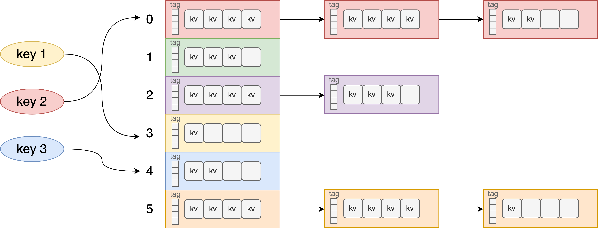

# Concurrent Hash Table Lookup And Acceleration

Ying Jiang(yingj2), Yinyue Wu(yinyuew)

[Webpage](https://yinyuewu.github.io/pp_proj/), [Proposal](https://docs.google.com/document/d/1p-4ZW6j7hIqzQ5MTeOEJtKItRQBa0rUQn5Yd-SMT_Fc/edit?usp=sharing), [Milestone Report](https://docs.google.com/document/d/1rK5UNwY7Ls92XXNXKZ1_vxWh7i32Linotv4zExdJOAg/edit?usp=sharing), [Final Report](https://docs.google.com/document/d/1NH9x1x7mxMohAdvNiLL6as_F3ClMshZP1ZAmel7fiks/edit?usp=sharing)

## Summary

We implemented a concurrent closed-address hash table with different settings. We first explore different locking mechanisms: coarse-grained locking, fine-grained locking, and the lock-free mechanism. We next accelerated the lookup with some strategies: 1. Storing extra tags (short hashes) in addition to key-value pairs for fast key lookup on the buckets, and found the best tag size to be 8 bits. 2. Utilizing SIMD to speed up checking multiple keys at a time. 3. Utilizing CUDA with CAS operations to speed up the lock-free version. We performed experiments on GHC and PSC machines with changes in the number of threads, different sizes of keys/tags/buckets, and read-write ratio. We demonstrated that the most performant CPU implementations are fine-grained tagged SIMD and lock-free versions, and GPU performed far better due to massive parallelism. 

## Background

Hash Table, also known as Hash Map, is a widely used data structure in all places of software systems. It maps keys to values. A hash table uses a hash function to compute an index into an array from which the value can be found. A hash table provides insert, lookup, and delete operations in averaged constant time. We focus on implementing the three operations: 1. InsertOrUpdate, 2. GetVal and 3. Remove. 

A collision could happen in a HashMap when two or more keys produce the same hash value and hence point to the same bucket location. Two common methods to resolve the collision are linear probing and chaining. Linear probing searches the table for the closest following free location and inserts the new key there. Chaining resolves collisions by allowing each slot to hold a reference to a collection of items with the same key. To make our project more realistic, we choose to use closed-address tables (linear open-address works similarly as we probe within the bucket), as illustrated in the picture. The locality is good within a bucket but not good across chained buckets. 

The standard implementations of hash tables in many programming languages are not thread-safe, but multi-thread access is the norm in many applications. Concurrent operations of insertions/deletions / lookups would be the main source of parallelism. Due to the caveats of lock-free programming, existing lock-free implementations are mostly based on linear probing, or simple chaining with 1 k-v pair per node, which is not very realistic when there’re many collisions. Therefore, in this project, we will explore building a concurrent hash table using different parallel programming techniques so that multiple threads can operate on the same hash table efficiently.

## Challenge

1. Workload Characteristics
   * Communication: The communication relies on a shared memory model. There is no explicit communication between threads in the same process. The main overhead for communication would be guarding the critical sections.
   * Dependency: There is implicit dependency across threads determined by the content in the hash table. 
   * Memory accesses: To make our project more realistic, we choose to use closed-address tables (linear open-address works similarly as we probe within the bucket). The locality is good within a bucket but not good across chained buckets.
     1. Make use of the fact that locality across buckets can be sacrificed.
   
        We assume that collisions are rare, and it is even rarer for collisions to exceed the bucket size. So we plan to implement a bucket array as the main table entries, with the number of buckets << number of different hash keys. We don’t need locality across buckets, so bucket size can safely be designed as cache size. The sparsity assumption helps in terms of having only a few chained buckets as long as the load factor is reasonable.
     2. Storage alternatives for faster key lookups.

        Storing keys (or just the hash of the key) consecutively allows us to do fast key lookups (better for SIMD optimization) and makes the memory footprint smaller. But this introduces multiple address updates, as stated in the next point. Storing key-value pairs together is easier to achieve atomicity for inserts/deletes/updates using CAS but harder for fast lookup since we read keys in an interleaving fashion. Getting the best of both worlds is hard.
   * Divergent execution: each key lookup is a relatively independent operation.

2. Constraints of lock-free implementation using CAS
   * Hash table insertion/deletion involves multiple operations, which is hard to ensure atomicity for the lock-free implementation. Protecting multiple operations on different addresses is more common for lock-based approaches. For example: check the key + set value; update both hashtable and bitmap; maintain consistency of data and hashtags.
  
        We can try to squeeze in more information in the keys to achieve atomicity, e.g., bit indicators for empty/invalid slots, but this is still limited.
        
        More specifically, tomb optimization for deleted entries can’t be implemented using CAS since recording the encountered empty slots / concurrent insert / delete operations / key checkings may interleave.
        
        Concrete example: Thread A and B are inserting the same key. Thread A records the index of the first tombstone it saw as X. Some concurrent delete operations happen in the same bucket and delete slot index Y, with index Y < X. Thread B started insertion a bit later and recorded slot Y as an available tombstone. However, A’s intent to insert the same key is not visible to B yet. If B finishes examining past slot X before A finishes insertion into X, B will think it’s inserting a new key and end up successfully taking slot Y. So in the end, both X and Y contain the duplicated key.
        
        We should either settle with a no-tomb version (deleted keys never disappear, and inserts happen at the end of buckets) or use fine-grained locking for this experiment.
3. Constraints of CUDA programming
   * CUDA has no support for bit-level CAS (the smallest is int16_t). We can either waste more space or read a full int containing the address and set the old values as "expected." Also, mutexes on GPUs are notoriously slow.
   * It is hard to allocate memory dynamically on the GPU. For example, when we want to use chained buckets, we have to pre-allocate some memory buffer for storing all buckets.

## Resources

1. Type of computers: GHC for <= 8 core OpenMP, SIMD, and CUDA evaluations. PSC for more CPUs.
2. Code base we start from: we will start from scratch and will compare implementation with standard C++ unordered_map
3. References:
    * Lock Free Papers:
      * https://docs.rs/crate/crossbeam/0.2.4/source/hash-and-skip.pdf
      * https://arxiv.org/pdf/1601.04017.pdf
      * https://www.osti.gov/servlets/purl/1118153
    * Linear probing illustration:
      * https://web.stanford.edu/class/ee380/Abstracts/070221_LockFreeHash.pdf
      * A simple version with linear probing, no deletes, k and v are non-zero integers: https://preshing.com/20130605/the-worlds-simplest-lock-free-hash-table/
      * Linear probing on virtual buckets, with no deletion of keys: https://ssteinberg.xyz/2015/09/28/designing-a-lock-free-wait-free-hash-map/
4. Special resources: None

## Goals and Deliverables

The goals of this project are listed below.

75% -- Finish exploring different locking mechanisms 
1. Implement a concurrent hash map using different locking mechanisms on CPU OpenMP.
   * Implement a concurrent hash map with a coarse-grained lock.
   * Implement a concurrent hash map with a fine-grained lock.
   * Implement a lock-free concurrent hash map using CAS (no tombstone optimization, reason stated above).
2. Implement alternative techniques of storing k-v pairs only / continuous key storage for fast lookups for ~~both fine-grained and CAS versions~~ only the blocking versions.
   * Store keys only once. Just store keys and values pairs as entries
   * Continuous storage of key hashtags for fast lookup. Tradeoff between extra space vs. fast key lookups by storing all keys/hashes consecutively for better locality and SIMD efficiency.
3. Set up benchmark validation to guarantee the correctness of the implementations.
4. Profile and evaluate the scalability of different implementations.
5. Experiments planned: read-only / read-heavy / write-heavy workload, the number of threads, with/without tombstones, different fill factor thresholds, different extra space/tag size allocated for faster key lookups

100% -- Acceleration

6. Utilize SIMD instructions to speed up for lookup keys, and find out under what circumstances this would work best.
7. Build CUDA implementation by using atomic CAS to perform lookups and deletes.

125% -- Others

8. To allow more flexibility in a value size and make buckets smaller, we can store pointers to the real k-v pairs in buckets instead of real data. This will introduce one more layer of indirection. We use the hash tags in bullet 2b for quick validation to decide whether we should look into the real KV or not. Find out the best cache-aware setting. (?) Since tags would not work when stored separately, explore storing them next to the storage ptr.
9. Allow efficient resizing for the table

Deliverables:

At the poster session, we are going to illustrate the evaluation of all implementations. We will show the scalability comparison of different implementations. We are going to present the performance of each implementation on different workload benchmarks. We are also going to show the experiment outcomes about how the performance varies with the changes in the number of threads, different thresholds, and different allocated space sizes.

We’ll submit reproducible code for all experiments in Github.

## Platform Choice

We’ll use GHC machines for 8-core CPU testing / for CUDA experiments. This is not a deep learning task, so 8GB memory from NVIDIA RTX 2080 would definitely be enough. 15.5GB memory of a single GHC machine is also enough.

Assume per entry size 4B key + 8B value (Pointers, at most) + 4B tag per entry = 16B. The real data associated with each pointer is not important for our purpose. If we allocate half the GPU space (4GB) and the rest for additional data/experiment setups, the upper bound of hash tables would be around 4GB / 20B = 0.2G key-value pairs. This is realistic for the experiment.

We’ll use PSC for experiments with more CPUs.

Using C++ for this task is also appropriate since the hash table is a fundamental data structure for any language and requires high efficiency.

## Schedule

| Time | Plan | 
|------|------|
| 11/7 ~ 11/13 | (Done) Research and Proposal |
| 11/14 ~ 11/20 | (Done) Implement versions of coarse-grained/fine-grained locking with two storage alternatives and do validation |
| 11/21 ~ 11/27 | (Done) Implement lock-free version and do validation |
| | (Done) Build SIMD implementation for different alternatives | 
| 11/28 ~ 11/30 | (Done) Preliminary comparison of SIMD implementations, storage alternatives with basic CPU implementation |
| | (Done) Milestone Report | 
| 11/30 ~ 12/2 | (Done) All: Optimize current versions of code | 
| 12/3 ~ 12/6 | (Done) All: Add storage format support: storing pointers to original KV pairs for tagged fine-grained locks and lock-free versions, w/ and w/o SIMD |
| 12/7 ~ 12/11 | (Done) All: GPU implementation |
| 12/12 ~ 12/15 | (Done) All: Finish profiling, scalability analysis, and different experiments |
| 12/15 ~ 12/18 | (Done) All: 125% goals of Explore lock-free version with hashtag + ptr stored together, resizing / migration, etc |
| | Create poster | 

